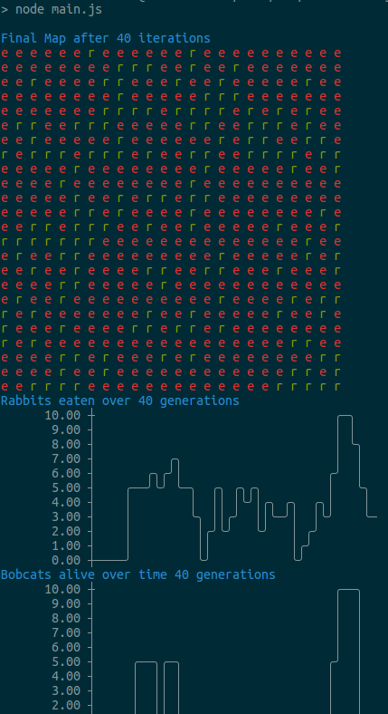

<h1>Rabbits and Bobcats<h1>

This is a simple project used to calculate and graph a population of rabbits and bobcats over a set period of generations.
  To use this project, simply clone the repo and configure your changes in the top of `main.js`.
 Run `npm start` to start the application. It will print its results to console.
  An example output
 

